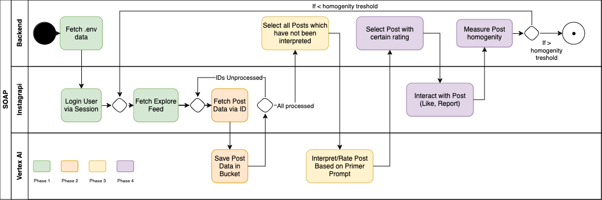

# SOAP Instruction

**Repository for Paper:**  
[*From Walls to Windows: Creating Transparency to Understand Filter Bubbles in Social Media*](https://www.alexandria.unisg.ch/entities/publication/f41060db-3d3b-4071-ad92-8ac6bb1cc734/details)  
Proceedings of the Second Workshop on the Normative Design and Evaluation of Recommender Systems (NORMalize 2024), co-located with the 18th ACM Conference on Recommender Systems (RecSys 2024), Bari, Italy, October 18, 2024.

## Disclaimer

SOAP is currently under development, with new features and improvements being added. The following features are in progress:

- [ ] Adding new open-source multimodal large language models
- [ ] Expanding documentation
- [ ] Providing a guide for deploying SOAP on Cloud services and via cron jobs

## Set-Up

SOAP currently runs on Google Cloud Vertex AI, utilizing the multimodal model Gemini 1.5 flash. To run the code as-is, a Google Cloud account is required. The deductive coding component can also be replaced with another model (either self-hosted or on another platform). The following are needed to run the code as-is:

- Instagram account credentials (username and password). It is recommended to use bot/fake accounts as there is a risk of accounts being flagged for automated behavior, potentially resulting in restrictions or bans.
- Google Cloud:
  - `GOOGLE_APPLICATION_CREDENTIALS`
  - `BUCKET_NAME`
  - `PROJECT_NAME`
  - API credits for both storage (bucket) and LLM usage

## Running the System

The system is orchestrated and managed by the `orchestrator.py` script, which coordinates all the necessary components, as shown in "Figure 1: Agent Scenario for Creating Filter Bubbles based on Primer Prompts."

The following table outlines the key classes and their respective functions:

| **Class**               | **Function**                                             |
|-------------------------|----------------------------------------------------------|
| `explorefeed_scraper.py` | Scrapes Explore feed data from Instagram                 |
| `saveFeedCloud.py`       | Saves scraped feed data to Google Cloud Storage          |
| `VertexAi.py`            | Utilizes Google Cloud Vertex AI for multimodal analysis  |
| `steering_wheel.py`      | Interacts with Instagram by liking, reporting, or archiving flagged posts |

## Reliability Testing

Before deploying a new prompt for creating filter bubbles, it is recommended to conduct reliability testing with the prompt and the multimodal language model (LLM). Code for both inter-reliability and intra-reliability testing can be found in the `/reliability-evaluation/` directory.

## Contact

If you have questions about the prototype or the publication, feel free to contact Luka Bekavac ([lukajurelars.bekavac@student.unisg.ch](mailto:lukajurelars.bekavac@student.unisg.ch)).

This research was conducted in collaboration by the Interaction- and Communication-based Systems Group ([interactions.ics.unisg.ch](https://interactions.ics.unisg.ch)) at the University of St.Gallen ([ics.unisg.ch](https://ics.unisg.ch)).

## License

All source code in this repository is licensed under the Apache License 2.0 (see [LICENSE](https://github.com/Interactions-HSG/blearvis/blob/main/LICENSE)) if not stated otherwise.
Included third-party code may be licensed differently (see the respective files and folders).
